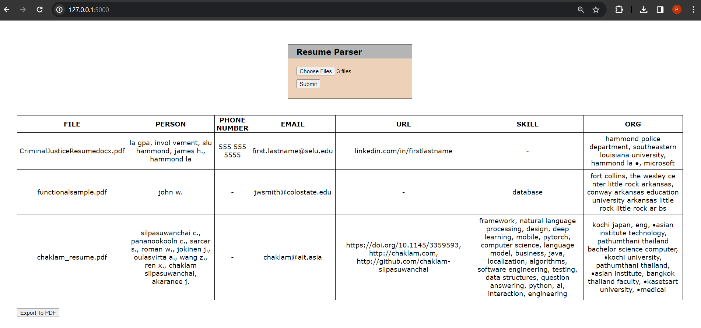
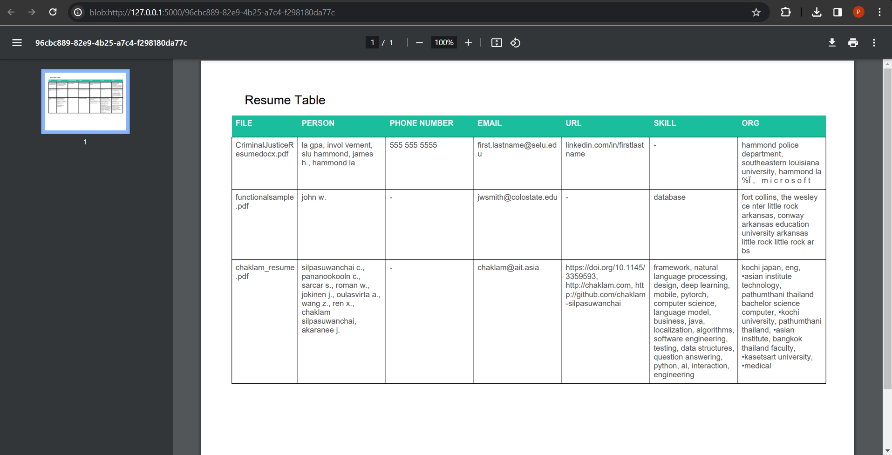

# NLP-A4-Resume-Parser
 
## Description:
Resume Parser application using spaCy's entity rule and matcher.

## How to use:
1) From the terminal, use the 'cd' command change directory to 'NLP-A4-Resume-Parser/app/' folder.
2) Run the Python script 'app.py'.
3) Open your browser and go to '127.0.0.1:5000' to access the site locally.
4) Upload resume files in PDF format (can be single or multiple files) then click the submit button.
5) A table displaying entities such as persons, skills, contact info for each uploaded resume will be shown below.
6) Optional: Click the 'Export to PDF' button to download the table as PDF file.

